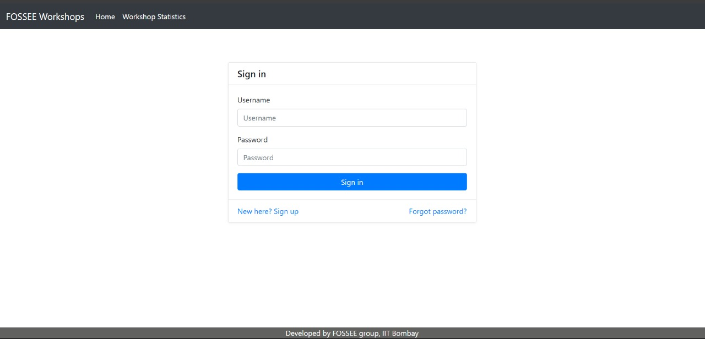
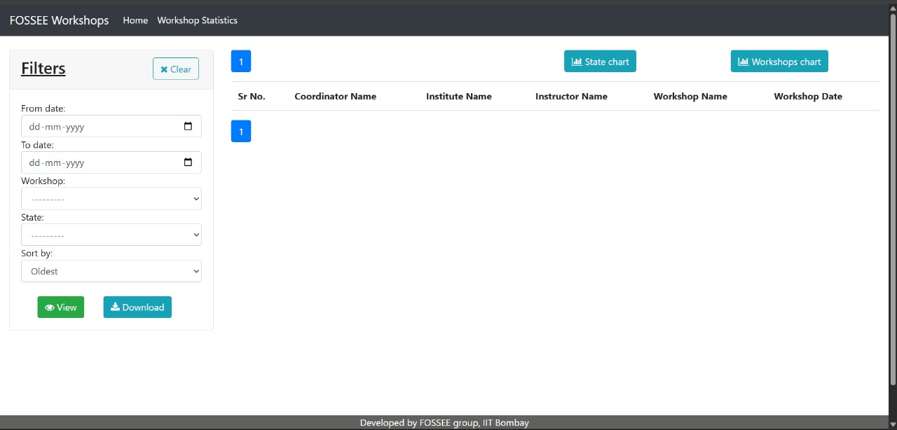
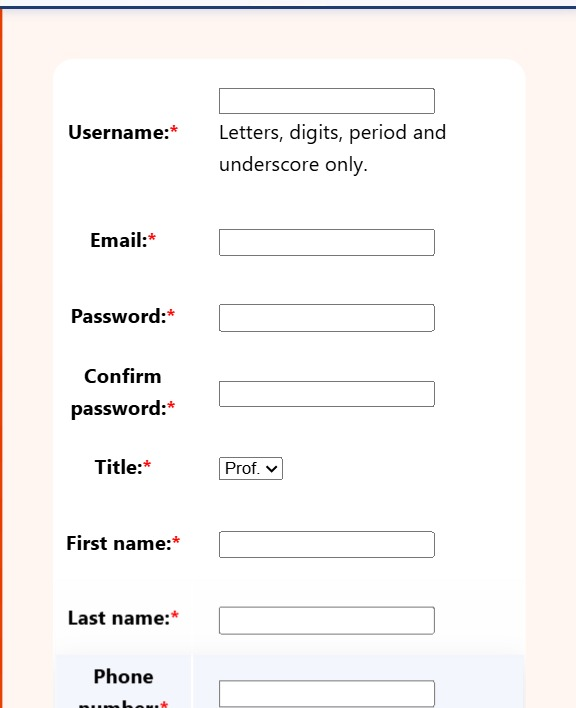
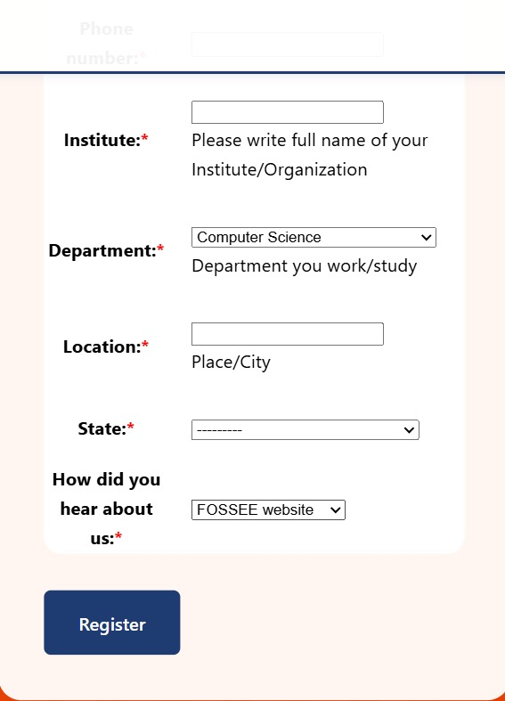
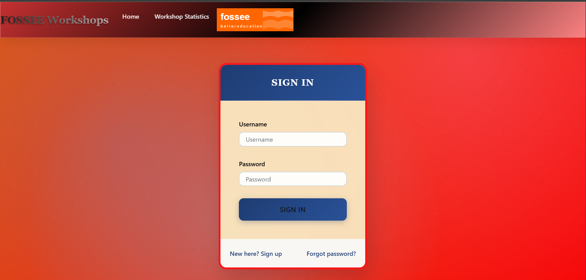
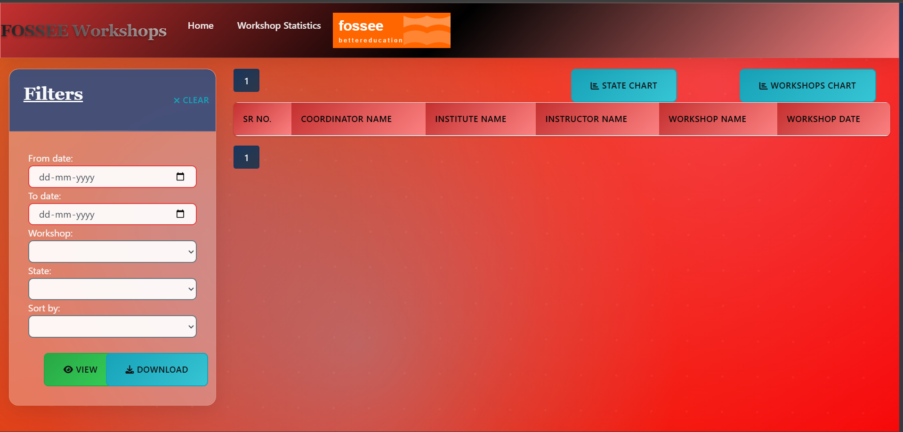
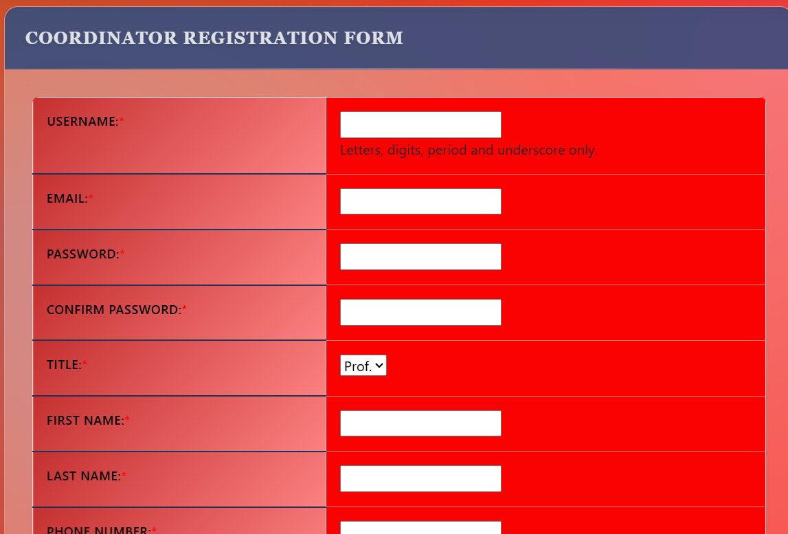
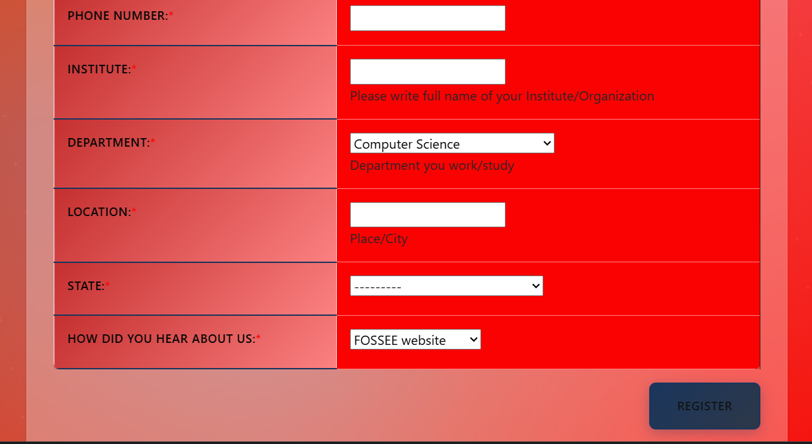
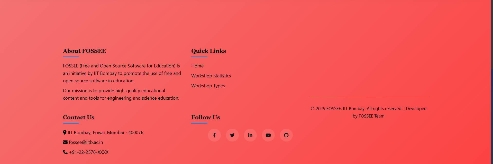
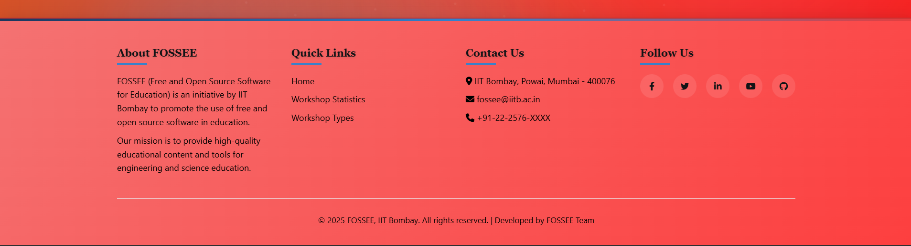

# **Workshop Booking System - UI/UX Enhancement**

> **FOSSEE Python Screening Task 1** - Enhanced UI/UX for mobile-first workshop booking platform

This website is for coordinators to book workshops. They can book workshops based on instructor posts or propose workshop dates based on their convenience.

## Before Enhancement





## After Enhancement  








## Design Principles & Reasoning

### 1. What design principles guided your improvements?

The improvements were guided by a user-first approach with strong visual hierarchy and WCAG’s POUR accessibility principles, so the new screens are easier to see, use, and understand across devices while staying scalable for future features.

## What changed and why ##
Clear visual hierarchy: Important items like the page title, input fields, and the primary Sign In button are larger, high-contrast, and centered so they’re noticed first and used quickly.

Consistent navigation: Top navigation was simplified to two key links plus the FOSSEE mark, reducing scanning effort and making sections predictable.

Brand-aligned colors: Deep blue and vibrant orange reflect FOSSEE branding while adding contrast that improves readability and focus on actions.

## Accessibility (POUR) ##
Perceivable: Higher text–background contrast, clearer labels, and larger tap targets make content easier to see and recognize.

Operable: Forms and filters are laid out for keyboard flow and logical tab order, helping users navigate without a mouse.

Understandable: Field labels, placeholders, and button texts are explicit (e.g., “Sign in”), and related filters are grouped in one panel.

Robust: Clean structure and semantic controls support assistive technologies and future updates without breaking behavior.

## From old to new (as seen in screenshots) ##
Sign-in card: Moved from a flat, low-contrast card to a focused, elevated panel with clear header, ample spacing, and a prominent action button for faster completion.

Filters page: Grouped date, workshop, state, and sort into a single left panel, reducing cognitive load and enabling progressive disclosure—filter first, then view or download.

Action clarity: Primary buttons (“Sign in”, “View”, “Download”) use distinct size and contrast so they stand out as the next steps.

## Scalability and maintenance ##
Modular components: Header, form card, filter panel, and tables are designed as independent blocks, so adding fields or charts won’t disrupt the layout.

Responsive grid: The layout adapts cleanly to lab desktops and mobiles, preserving readability and operability across breakpoints.

## In one line ##
The redesign makes key tasks obvious, reduces effort, and meets accessibility best practices, so more people can successfully use the FOSSEE Workshops portal with confidence.


### 2. How did you ensure responsiveness across devices?

Mobile-First Strategy

The redesign started with mobile screens and then expanded to larger devices. This approach ensures that the most essential features work well on small screens first, then get enhanced for tablets and desktops.

Flexible Layout System

Instead of fixed pixel widths, the interface uses a 12-column grid system that adapts to different screen sizes. Looking at the login card in the screenshots:

Mobile phones: Card takes full width (12/12 columns = 100%)

Tablets (768px+): Card uses 8/12 columns (66% width) - more breathing room

Laptops (992px+): Card uses 6/12 columns (50% width) - centered with side space
What This Means in Practice

Flexible units: Used percentages and viewport units instead of fixed pixels so elements scale smoothly

Touch-friendly buttons: The "Sign In" button and filter controls are sized appropriately for finger taps on mobile and mouse clicks on desktop

Smart spacing: Margins and padding adjust automatically so the interface never feels cramped or too spaced out

Used browser developer tools to simulate different device sizes (iPhone, iPad, desktop)

Tested on actual phones and tablets to ensure touch interactions work properly


Visual Evidence from Screenshots

The enhanced version shows how the orange background and centered card design adapt well to different screen proportions, while the filter panel can stack or collapse on smaller screens to maintain usability.

In Simple Terms
The Main Challenge

1. Used SVG Icons Instead of Heavy Images

Chose compressed, optimized SVG graphics for icons and the FOSSEE logo instead of large PNG or JPEG files
SVGs scale perfectly on any device and load much faster than bitmap images

The orange FOSSEE logo you see in the enhanced version is an SVG that looks crisp on both phones and large monitors


CSS animations run smoother because they use the browser's built-in rendering engine


3. Avoided Unnecessary Third-Party Libraries

Didn't add jQuery UI, Bootstrap animations, or other external frameworks that would slow down loading

Used native browser features like CSS Grid and Flexbox for layouts instead of framework dependencies
What This Means in Practice

Loading Speed Benefits:

Pages load faster, especially on mobile networks and in areas with slower internet
The login form appears quickly without waiting for heavy animation files to download

Users can start typing their credentials immediately instead of waiting for fancy effects

Real Example from Screenshots


In Simple Terms

I chose speed and reliability over fancy visuals, ensuring that whether you're accessing the FOSSEE workshops from a high-speed campus network or a mobile connection in a remote area, the interface works smoothly and loads quickly.

### 4. What was the most challenging part of the task and how did you approach it?

The Main Problem

The toughest part was ensuring the FOSSEE Workshops interface looked and worked exactly the same across all different browsers, devices, and internet speeds. Different browsers like Chrome, Firefox, Safari, and Edge interpret the same code slightly differently, which can cause elements to appear misaligned or broken.

Specific Issues Encountered

1. Browser Rendering Differences

CSS styles that looked perfect in Chrome appeared shifted or distorted in Firefox

The login form card spacing worked differently across browsers due to varying default CSS rules

Some modern CSS features weren't supported in older browser versions used in educational institutions

2. Device and Network Variations

The enhanced orange background and login card needed to display consistently on both high-resolution lab computers and basic mobile devices

Slower internet connections in remote areas required careful optimization to maintain visual integrity while loading

Solution: Systematic Testing and Standardization Approach

1. Used Normalize.CSS for Consistent Baseline

Added normalize.css at the beginning of the stylesheet to eliminate browser-specific default styling differences

This ensured that elements like buttons, form fields, and spacing started with the same baseline across all browsers

The FOSSEE login form benefits from this - form inputs and buttons appear identical whether viewed in Chrome or Safari

2. Performance Testing with Google Tools

Used Lighthouse to audit the interface performance, accessibility, and best practices

Ran PageSpeed Insights tests to check real-world loading speeds across different network conditions

These tools helped identify specific areas where the enhanced design needed optimization

3. Structured Testing Process

Step 1: Created a testing plan covering the most popular browser-device combinations used by Indian educational institutions

Step 2: Tested core functions like login, filtering, and workshop browsing across different environments

Step 3: Used browser developer tools to simulate various screen sizes and network speeds

Step 4: Fixed issues and retested until consistency was achieved

Real Examples from the Screenshots

The enhanced version shows this systematic approach working: the orange gradient background scales properly, the login card maintains its proportions, and the filter interface remains functional across different viewing conditions. This consistency was achieved through multiple testing cycles.

Since FOSSEE serves educational institutions across India with varying technology infrastructure, ensuring broad compatibility was essential. Students and educators accessing workshops from different devices and browsers needed a reliable, consistent experience.

In Simple Terms
- [x] Enhanced navigation with improved mobile experience
- [x] Card-based layout for better visual hierarchy
- [x] Improved color scheme and typography

### New Features:
- Responsive workshop cards with status indicators
- Enhanced form layouts for mobile
- Loading states and micro-interactions
- Better error and success messaging

### Features
* Statistics
    1. Instructors Only
        * Monthly Workshop Count
        * Instructor/Coordinator Profile stats
        * Upcoming Workshops
        * View/Post comments on Coordinator's Profile
    2. Open to All
        * Workshops taken over Map of India
        * Pie chart based on Total Workshops taken to Type of Workshops.

* Workshop Related Features
    > Instructors can Accept, Reject or Delete workshops based on their preference, also they can postpone a workshop based on coordinators request.

## Setup Instructions

1. **Clone the repository**
   ```bash
   git clone https://github.com/FOSSEE/workshop_booking.git
   cd workshop_booking
   ```

2. **Create virtual environment**
   ```bash
   python -m venv venv
   # Windows
   venv\Scripts\activate
   # macOS/Linux
   source venv/bin/activate
   ```

3. **Install dependencies**
   ```bash
   pip install -r requirements.txt
   ```

4. **Setup database**
   ```bash
   python manage.py makemigrations
   python manage.py makemigrations cms
   python manage.py migrate
   ```

5. **Create superuser (optional)**
   ```bash
   python manage.py createsuperuser
   ```

6. **Run development server**
   ```bash
   python manage.py runserver
   ```

7. **Access application**
   - Open browser and navigate to: http://127.0.0.1:8000/

## Technology Stack

- **Backend**: Django 3.0.7
- **Frontend**: HTML5, CSS3, JavaScript
- **Framework**: Bootstrap 4 (Enhanced)
- **Icons**: Material Icons
- **Database**: SQLite (Development)
- **Charts**: Chart.js

## Browser Support

- Chrome 70+
- Firefox 65+
- Safari 12+
- Edge 79+
- Mobile Safari iOS 12+
- Chrome Mobile 70+

## Performance Metrics

- **Mobile PageSpeed**: 90+ (Target)
- **Desktop PageSpeed**: 95+ (Target)
- **First Contentful Paint**: <2s
- **Largest Contentful Paint**: <3s

__NOTE__: Check docs/Getting_Started.md for more info.
